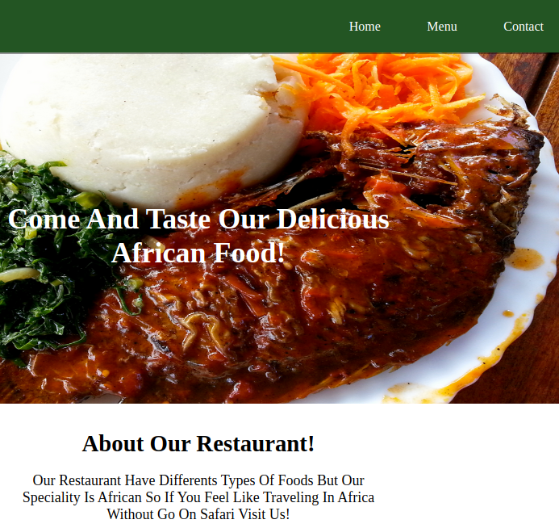

# Restaurant_homepage

The main goal of this project was to practice the knowledge of DOM manipulation by dynamically rendering a simple restaurant webpage.




## Features

- A user can visit a homepage
- A user can view our menu
- A user can contact us

## Built With

- Javascript
- HTML
- CSS
- Webpack

## Getting Started

* Clone this repo
    ```
    git clone git@github.com:DeliceLydia/Restaurant_homepage.git
    ```
* Navigate to Library_app folder
    ```
    cd Restaurant_homepage
    ```
* On the terminal, while in the 'Restaurant_homepage' directory:

* Run ``` git checkout feature-branch ```

* Run ``` git pull origin feature-branch ```

* Run ``` yarn install ``` or ``` npm install``` to install dependencies

* Run ``` npx webpack ```
   
* Go to the browser and enter 
    ```http://127.0.0.1:5501/dist/index.html``` and you are now able to visit the app


## Live Demo

Click [here](https://delicelydia.github.io/Restaurant_homepage/#)

## Author

👤 **Delice Lydia**
  - GitHub: [Delice Lydia](https://github.com/DeliceLydia)
  - Twitter: [Delice](https://twitter.com/IngabireLydia3)
  - LinkedIn: [Delice Lydia](https://www.linkedin.com/in/delice-lydia/)

## Contributing

- Fork the project
- Create your feature branch ``` git checkout -b awesome-feature```
- Commit your changes ``` git commit -m 'awesome feature' ```
- Push it ``` git push -u origin awesome-feature```
-  Open a pull request using this branch

## Show your support

Give a ⭐️ if you like this project!

## License
​
This project is [MIT](https://github.com/DeliceLydia/Restaurant_homepage/blob/master/LICENSE) licensed.
